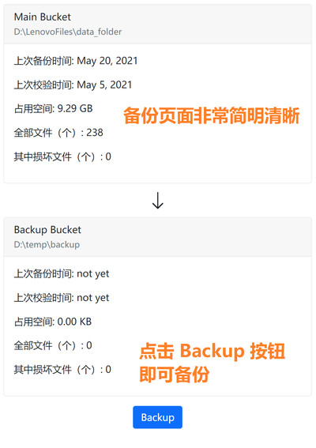
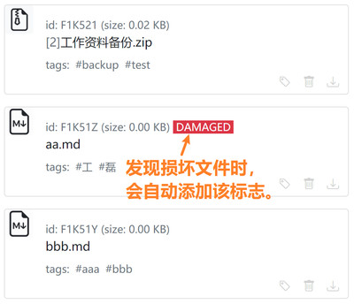
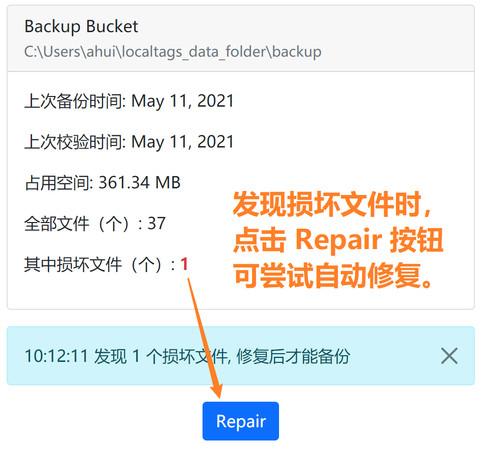

# 关于备份

- 本软件采用单向备份方式，永远以 *主仓库* 为准，如果在主仓库删除了文件，备份时，也会删除 *备份仓库* 中的对应文件。用户无法直接操作备份仓库。
- 简而言之：在本软件中，备份操作的最终效果等同于 “清空备份仓库，然后把主仓库的全部文件复制到备份仓库中”（可以这样帮助理解，但实现细节不是这么简单粗暴）。

## 关于文件的损坏与修复

- **文件损坏**：是指文件的内容发生了意料之外的改变，通常是因硬盘故障引起的。（因此，当出现损坏文件时，请留意硬盘的健康程度）

  

- 当发现文件损坏时，会禁止备份，并出现 "Repair" 按钮，点击该按钮可尝试自动修复文件。

  

- **自动修复文件**：点击 "Repair" 按钮后，对于备份仓库中的损坏文件，会尝试从主仓库获取同一个 ID 的文件；而对于主仓库中的损坏文件，则尝试从备份仓库获取同一个 ID 的文件；如果同一个 ID 的文件在主仓库和备份仓库里都损坏了，则无法自动修复，需要手动修复。

- **手动修复**的步骤，对于主仓库：1.下载受损文件 2.删除受损文件 3.重新上传文件。而对于备份仓库，则只能一键删除全部受损文件。

- **(update: 2021-05-18)** 另外，对于主仓库，还可以使用 "替换文件" 功能进行手动修复，详见 [关于同名文件](https://github.com/ahui2016/localtags/wiki/Same-Name-Files) 的 "例子三"。

### 把备份仓库转换为主仓库

万一，主仓库所在的硬盘突然整个坏掉，或者丢失、被盗，这种情况下需要把备份仓库整个转换为主仓库。暂时我还没有做自动转换工具，但手动转换也不麻烦。

假设备份文件夹是 `D:/localtags/backup`, 手动转换的步骤如下：

1. 按正常方式安装 localtags (详见 README.md)
2. 运行 localtags, 然后关闭 localtags, 这样做是为了自动生成 config.json 文件
3. 把 `D:/localtags/backup/` 整个文件夹复制到另一个硬盘中，假设复制后我们得到文件夹 `C:/localtags/backup/`, 然后改名为 `C:/localtags/data/`
4. 打开 `C:/localtags/data/`, 把里面的 `backup_bucket` 文件夹改名为 `mainbucket`
5. 打开上面第 2 步生成的 config.json 文件，把  "DataFolder" 后的内容修改为 `"D:\\localfiles\\data"`

完成。

这样，我们就可以正常启动 localfiles, 可正常使用，但图片的缩略图没有了。后续我会更新程序，提供恢复缩略图的功能。（因为整个硬盘坏掉/丢失的情况极少发生，因此也不用太担心）。

