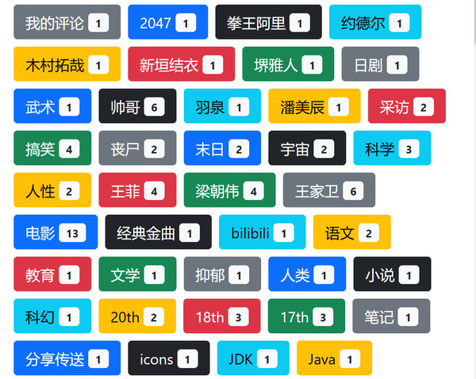
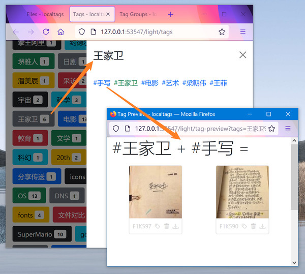
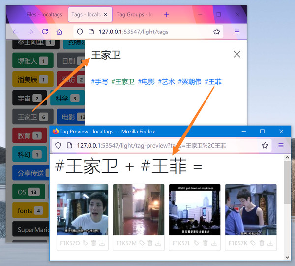

# 一些真实标签

以下是我自己使用 localtags 时产生的一些真实标签：

如上图所示，可以看到，其中有很多人名，木村拓哉、新垣结衣、羽泉、王菲、梁朝伟等等，**如果使用文件夹**，我不可能专门为这些人名建文件夹，但**如果使用标签**，为这些人名新增一个标签就没有心理负担。

下面我们点击其中一个人名标签，可以看到，会展示出全部相关标签，**这对我们人脑直观地感受每个标签的意义，并联想起各标签与文件的关系**是很有帮助的。

如上图所示，再点击其中一个关联标签，比如 "手写", 可以展示与 `#王家卫` 与 `#手写` 这两个标签都有关联的文件，我们看到，那是王家卫的手写剧本。

再点击其他相关标签看看：

再点击另一个相关标签：

注意上图，由于王家卫的手稿与王菲参演的电影片断都有 "电影" 标签，因此 `#王家卫 + #电影` 会把它们都展示出来。

以上是 tag preview 功能，**主要目的是快速地对每个标签产生直观的感性认识**。另外本软件还提供搜索功能，可以搜索一个或多个标签，可以更灵活地查找文件。

本文通过用真实的标签来举例，希望让你感受到标签比文件夹好用，有任何疑问欢迎发 issue 或发邮件与我联系（常用邮箱 102419@gmail.com）。

