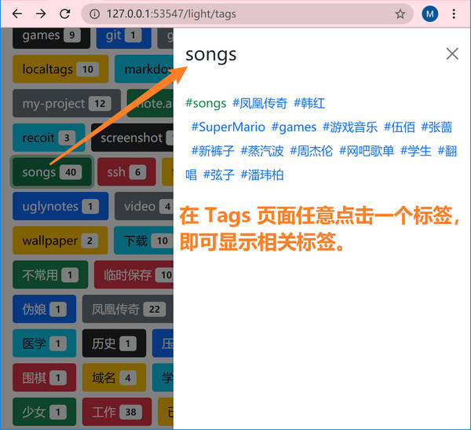
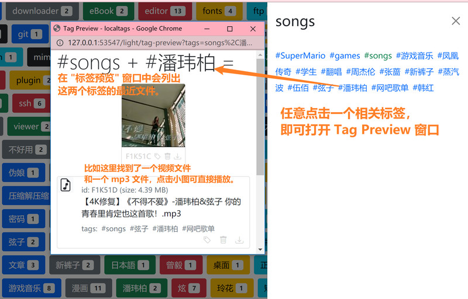

# Tag Preview (标签预览)

这是 2021-05-25 新增的功能。

- 如下图，在 Tags 页面，任意点击一个标签，即可列出相关标签。

- 见下图，再点击其中一个相关标签，即可查看这两个标签的最近文件。

- 该功能的主要目的是，让用户快速了解标签与标签的关系，对标签有更直观的感性认识。

## "标签组" 是本软件的一个关键概念

- 从上面的图中可以看出，标签预览功能并不是预览单个标签的相关文件，而是预览**两个**标签的相关文件。
- 普通的标签系统通常把一个个标签看成独立的个体，但在本软件中，标签总是组合起来使用的，每个文件至少必须拥有两个标签，只有这样做，标签才会真的有用。
- 利用标签组合，只需要简单的几次点击，即可精确地找到文件。而如果像别的软件那样通过点击单个标签来找文件，当文件多了之后，就会变成大海捞针，每一个单独的标签都对应海量的文件，这就是标签这个概念看起来很美丽，事实上却很少人用的原因。本软件解决了这个问题。
