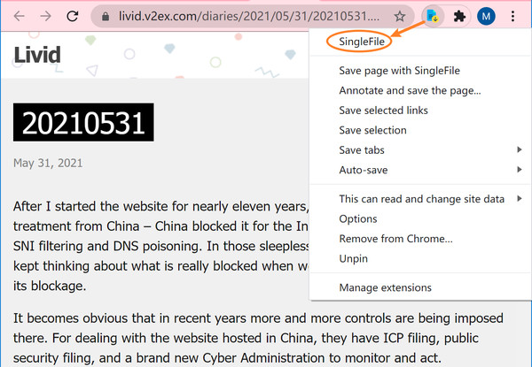
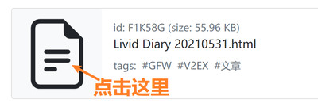
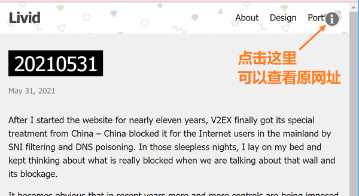

# Localtags with SingleFile

SingleFile 是一个非常优秀的网页剪藏插件，Chrome(及使用相同内核的浏览器) 与 Firefox 都可以安装该插件。

- 如上图所示，直接点击插件图标可以剪藏整个网页。还可以选择网页的一部分内容，然后右键点击插件图标，再点 Save selection 即可剪藏选中的部分。
- 剪藏后，会得到一个 html 文件，图片等都在这个文件里，可以直接双击打开，网页布局和图片都不会乱。

- 把剪藏获得的 html 文件按正常流程保存到 localtags 里，如上图所示，可以随时点击小图标离线查看网页。
- 效果如下图所示。

- 可见，localtags 与 singlefile 搭配起来使用，可以永久保存网页，离线查看，并且由于 localtags 具用强大的标签功能，可以井井有条地整理所收集的网页，随时可以轻松、快速地找出来。
- 并且，利用 localtags 的备份功能，收集到的网页可永久保存，永不丢失，不依赖网络。

