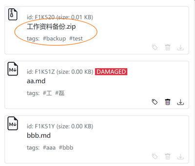
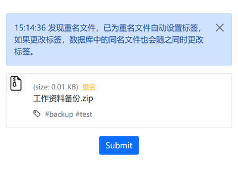
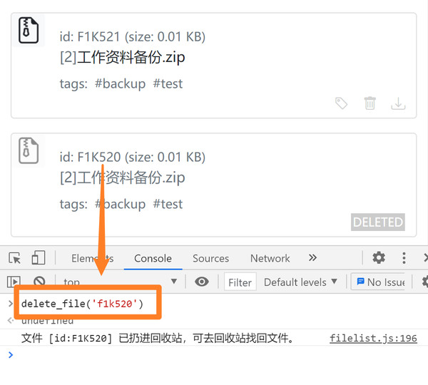
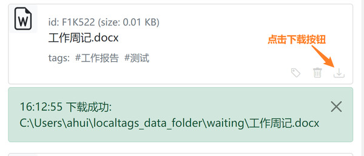
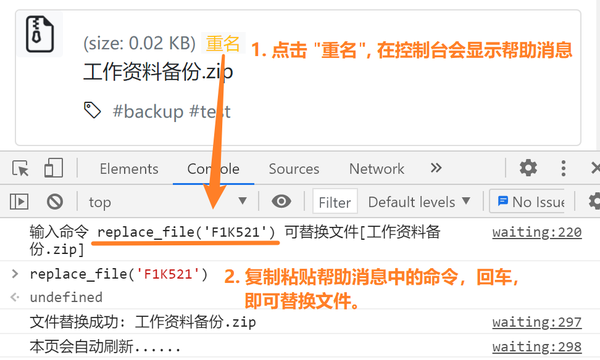

# localtags 使用技巧

localtags 是我自己日常使用的软件，因此在能力范围内我也会做一些小功能让操作更便利一些。

## 同名文件

### 例子一（两个版本）

1. 假设在 localtags 里已经有一个名为 <u>"工作资料备份.zip"</u> 的文件，标签是 "test" 和 "backup".

   

2. 然后，在这种情况下，我准备上传一个新的文件，文件名也是 <u>"工作资料备份.zip"</u>, 但里面的内容与上面 **"1"** 中所述的同名文件的内容不一样。

3. 把新文件放进 waiting 文件夹，在 waiting(待上传) 页面中，就可以看到提示 "发现同名文件", 并且已经自动设好了标签 "test" 和 "backup", 可以直接上传，非常方便。

   

4. 上传后，在文件名 <u>"工作资料备份.zip"</u> 的前面会有一个小数字 `[2]`, 表示有两个同名文件，点击小数字可以找出全部同名文件，按上传时间排列。

5. 如果希望隐藏其中一个不重要的版本，可以按 "F12" 进入网页控制台，使用 `delete_file` 命令把它扔进回收站。（另外，如果点击删除按钮则是彻底删除，不可找回。）

   

### 例子二（修改文件）

1. 假设在 localtags 里已经有一个名为 <u>"工作周记.docx"</u> 的文件。

2. 现在我想修改这个文件，可以点击下载按钮，它会被自动下载到 waiting(待上传) 文件夹中。

   

3. 由于 waiting 文件夹是固定不变的，因此可以将它添加到类似于 "快速访问" 的某种书签中，或使用 Everything, Listary 之类的必备神器快速打开指定文件夹。

4. 打开文件夹后双击打开文件，编辑、保存、关闭文件后再打开或刷新 waiting 页面（如果原已打开，一定要刷新），可以看到 <u>"工作周记.docx"</u> 已经自动设好标签，直接点击 submit 按钮上传即可。

5. 值得一提的是，按照上述方法操作后，我们获得了两个版本的 <u>"工作周记.docx"</u>, 旧版内容保持不变，因此永远不用提心在编辑文件的过程中删除了原有的内容。

### 注意事项

- 但要注意，上述两个例子中的用法，只适合偶尔更新文件内容，如果一个文件近期需要频繁修改，建议只有重要版本（比如积累改动较多，或预估接下来一段时间不再修改）才上传到 localtags 中创建一个新版本。
- 如果想更新文件，但不产生新版本，请看例子三。

### 例子三（替换文件）

1. 请看上面例子一中的1、2、3，接下来不是直接上传，而是点击 "重名" 标志。

   

2. 按 F12 可打开控制台，如上图所示，操作后，效果是用这个新的 <u>"工作资料备份.zip"</u> 文件去替换了 ID 为 `F1K521` 的文件。不会产生新版本，不会产生新的 ID, 同名文件数量也不会增加。

3. 由于进行该操作后旧文件 (在本例子中，就是 ID 为 `F1K521` 的文件) 的内容会被覆盖, 因此采用了比较复杂的操作方式，以防止不小心操作。

4. 这个方法适合比较频繁改动的文件，也可以用来修复破损文件，或者替换 markdown 图片（因为可以改变图片不改变 ID)。
